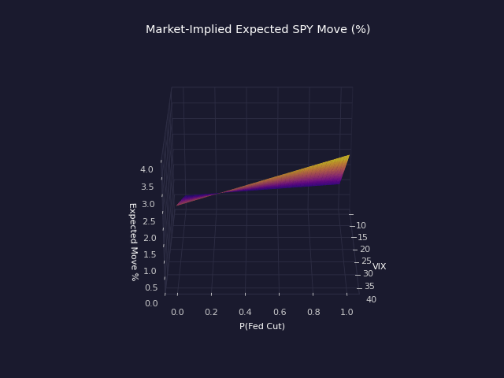
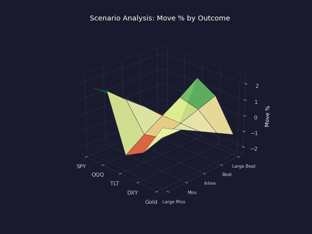
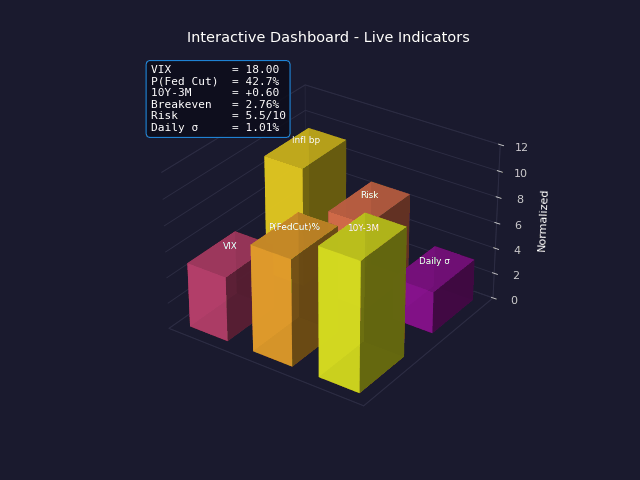
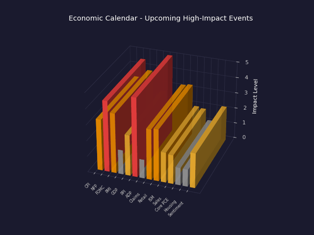
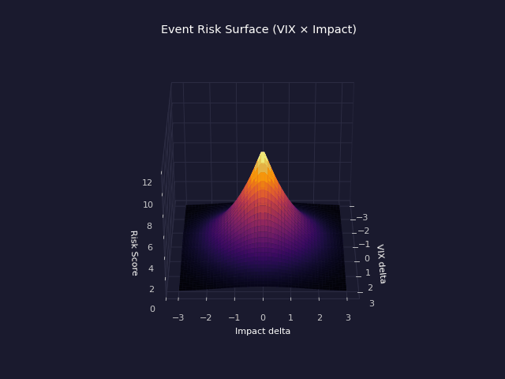
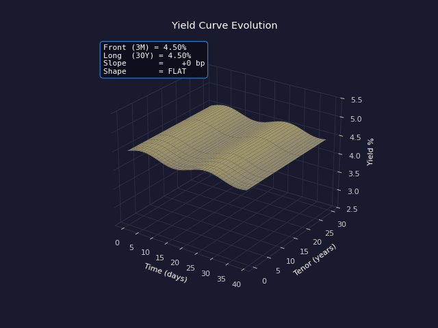

# Macro Event Impact Prediction System

A real-time system for predicting how macroeconomic events (CPI, NFP, PMI, interest rate decisions) will impact financial markets. **Predictions are derived from current market-implied expectations**, not just historical data.

## Key Features

> Each animation below has a **fixed camera** — the surface itself morphs as
> the model variables change. The HUD in the top-left of every clip shows the
> live values driving the surface.

### Market-Implied Predictions
Uses VIX, yield curve, Fed Funds Futures, and TIPS spreads to derive expected moves.



**What you see.** The surface is the model output `Expected Move % = f(VIX, P(Fed Cut))`,
computed as `(VIX / √252) · (1 + 0.6 · P_cut) · vol_factor`. The green dot marks the
*current* market reading on that surface.
**What animates.** `VIX` sweeps from 12 → 35 → 12 (low-vol regime to crisis-vol and
back); `P(Fed Cut)` oscillates around 35%. The whole surface lifts as VIX rises
because every cell is multiplied by `VIX / 18`.
**Read in HUD:** current `VIX`, `P(Fed Cut)`, and the resulting `Expected Move %`.

### Real-Time Analysis
Fetches current market data to generate up-to-date predictions.


**What you see.** A rolling 2D grid of `time × instrument` with the *expected
intraday move* as height. The wave speed scales with the live VIX tick — high
VIX = faster, sharper wiggles.
**What animates.** A pre-generated tick stream of `VIX`, `P(Fed Cut)` and
`Breakeven Inflation`. Each frame is one tick — the surface re-computes.
**Read in HUD:** tick number, current `VIX`, `P(Fed Cut)`, `Breakeven Inflation`.

### Multi-Asset Coverage
Predicts impacts on equities, bonds, FX, and commodities.


**What you see.** One bar per tracked instrument (SPY, QQQ, IWM, TLT, IEF, DXY,
EUR, JPY, Gold). Bar height = expected 1σ move %. Colors mark asset class:
🟢 equity, 🔵 fixed income, 🟠 FX, 🟣 commodity.
**What animates.** The `Event Impact` level cycles `LOW → MEDIUM → HIGH → CRITICAL`.
The internal multiplier (`0.5 → 0.8 → 1.2 → 1.8` from `prediction_engine.py`)
re-scales every bar. Asset-class type-multipliers (`equity 1.0, fi 0.7, fx 0.5,
commodity 0.8`) keep their relative shape.
**Read in HUD:** current `Event Impact`, the impact `Multiplier`, baseline
daily SPX σ.

### Scenario Analysis
Shows expected moves for different outcome scenarios (beat/miss/inline).



**What you see.** Surface of *Scenario × Instrument → Move %*. Five outcome
scenarios on Y (Large Miss → Large Beat), five instruments on X. Color codes
direction (red=down, green=up).
**What animates.** The `Event Category` cross-fades between
**Growth (NFP/GDP)** and **Inflation (CPI/PCE)**. The whole surface flips sign
on equities/bonds because for inflation events a *beat* (higher than consensus)
is bearish for risk assets, while for growth events a beat is bullish.
**Read in HUD:** current event category and the resulting beat/miss bias.

### Probability Distributions
Full probability density across implied volatility regimes.


**What you see.** A 3D normal-density surface. X = move %, Y = σ axis (vol),
Z = density. The surface is `Z = N(X; μ, σ)` evaluated on the grid.
**What animates.** Two model variables: the **mean μ** (directional bias from
Fed/inflation expectations) shifts left/right; the **σ scale** (overall vol
regime, driven by VIX) widens/narrows the surface.
**Read in HUD:** current `μ` and its regime label (BULLISH / NEUTRAL / BEARISH),
`σ scale`, and the resulting approximate `P(Up)`.

### Interactive Dashboard
Visualize predictions with an interactive web dashboard.



**What you see.** Six dashboard indicators as 3D towers in a 3 × 2 grid:
`VIX`, `P(Fed Cut)%`, `10Y-3M spread`, `Breakeven Inflation`, `Risk score`,
`Daily σ`. Tower height = each indicator's normalized value (0–10 scale per
indicator using its own swing range).
**What animates.** All six indicators stream new values out of phase — the
exact behaviour of the live Dash front-end.
**Read in HUD:** the raw numeric value of every indicator.

### Economic Calendar
Tracks upcoming high-impact events with consensus estimates.



**What you see.** 14 upcoming events on the X axis, bar height = impact level
(grey/yellow/orange/red = LOW/MED/HIGH/CRITICAL).
**What animates.** A cyan **TODAY** cursor walks along the timeline. Bars
within ±2 days of *today* are *boosted* in height (priority of imminent
events) and the bar at today's index pulses.
**Read in HUD:** current day index, today's event + impact, the next event
on deck.

### Risk Assessment
Event risk surface combining VIX intensity and event impact magnitude.



**What you see.** A peak whose height = combined risk score, derived from
`VIX/20 + impact_score/2` and bucketed into LOW / MEDIUM / HIGH / EXTREME
(the same logic as `_calculate_risk_assessment()`).
**What animates.** `VIX` ramps from 12 → 35. As VIX rises the peak climbs
(higher risk) **and sharpens** (concentrated tail risk in a high-vol regime).
The implied event-impact label steps up in lockstep.
**Read in HUD:** current `VIX`, derived `Event Impact` bucket, numeric
`Risk Score / 10`, and the qualitative `Risk Level`.

### Yield Curve Evolution
Animated 3D yield curve evolution across tenors and time.



**What you see.** The Treasury curve as a surface across `Time × Tenor`. Z
axis = yield %.
**What animates.** Two **independent** drivers: the **front-end** (3M, set by
the Fed) and the **long-end** (30Y, set by growth + inflation expectations)
each oscillate on their own period. The slope between them changes shape
(NORMAL ↔ FLAT ↔ INVERTED) across the run.
**Read in HUD:** current 3M and 30Y yields, slope in basis points, and the
shape label.

> The 3D animations above are generated by `assets/generate_3d_visualizations.py`.
> Re-run that script to regenerate the GIFs after dependency or styling changes.

## How It Works

Unlike traditional systems that just show historical reactions, this system derives predictions from **what the market is currently pricing in**:

1. **VIX & Implied Volatility** → Expected move magnitude
2. **Yield Curve Shape** → Rate expectations and recession risk
3. **Fed Funds Futures** → Probability of rate cuts/hikes
4. **TIPS Spreads** → Inflation expectations
5. **Historical Sensitivity** → Directional bias for different surprise outcomes

## Installation

```bash
# Clone the repository
git clone https://github.com/yourusername/Macro-Impact-Predictions-.git
cd Macro-Impact-Predictions-

# Create virtual environment
python -m venv venv
source venv/bin/activate  # On Windows: venv\Scripts\activate

# Install dependencies
pip install -r requirements.txt

# Copy environment template
cp .env.example .env
# Edit .env and add your API keys (optional but recommended)
```

### API Keys (Optional)

For best results, get free API keys:
- **FRED API**: https://fred.stlouisfed.org/docs/api/api_key.html
- **Alpha Vantage**: https://www.alphavantage.co/support/#api-key

The system works without API keys using demo/sample data.

## Quick Start

### 1. View Predictions (CLI)

```bash
# Show predictions for next 7 days
python main.py predict

# Show predictions for next 14 days with HTML charts
python main.py predict -d 14 --html

# Quick prediction for next event
python main.py quick
```

### 2. Launch Interactive Dashboard

```bash
python main.py dashboard
```

Then open http://127.0.0.1:8050 in your browser.

### 3. Use as Library

```python
from src.models.prediction_engine import PredictionEngine
from src.data.economic_calendar import EventImpact

# Initialize engine
engine = PredictionEngine()

# Get market-implied expectations
market_exp = engine.get_market_implied_expectations()
print(f"VIX: {market_exp['vix_current']}")
print(f"Daily SPX Move: ±{market_exp['daily_expected_move_spx']:.2f}%")
print(f"Fed Expectation: {market_exp['fed_next_meeting']}")

# Get predictions for upcoming events
predictions = engine.get_upcoming_predictions(
    days_ahead=7,
    min_impact=EventImpact.HIGH
)

for pred in predictions:
    spy_move = pred.expected_moves.get('SPY')
    print(f"\n{pred.event.event_name}:")
    print(f"  Expected SPY Move: ±{spy_move.expected_move_pct:.2f}%")
    print(f"  P(Up): {spy_move.probability_up*100:.0f}%")
```

## Output Example

```
📊 CURRENT MARKET EXPECTATIONS:
   VIX: 18.5 (normal volatility)
   Daily SPX Expected Move: ±1.17%
   Fed Next Meeting: hold (Cut: 35%)
   Yield Curve: Normal
   Risk Regime: neutral

[1] CPI MoM
    Date: 2024-01-11 08:30 ET
    Impact: CRITICAL
    Consensus: 0.3%

    📈 PREDICTED MOVES:
       SPY: ↓ ±0.89% (1σ: 1.75%) | P(Up): 42%
       TLT: ±1.22% (Bonds)
       DXY: ±0.58% (USD)

    🎯 SCENARIO ANALYSIS:
       BEAT         → SPY: -1.75%
       INLINE       → SPY: +0.18%
       MISS         → SPY: +1.75%

    ⚠️  Risk Level: MEDIUM (Score: 5.2/10)

    📌 KEY DRIVERS:
       • VIX at 18.5 (normal volatility)
       • Market pricing 35% cut / 10% hike
```

## Project Structure

```
Macro-Impact-Predictions-/
├── main.py                 # Main CLI entry point
├── requirements.txt        # Python dependencies
├── config/
│   └── settings.yaml      # Configuration file
├── src/
│   ├── data/
│   │   ├── macro_data_fetcher.py    # FRED/macro data
│   │   ├── market_data_fetcher.py   # Market prices & IV
│   │   └── economic_calendar.py     # Event calendar
│   ├── analysis/
│   │   ├── impact_analyzer.py       # Historical impact analysis
│   │   └── surprise_calculator.py   # Surprise metrics
│   ├── models/
│   │   └── prediction_engine.py     # Core prediction engine
│   ├── visualization/
│   │   ├── market_charts.py         # Plotly charts
│   │   └── dashboard.py             # Dash web app
│   └── utils/
│       ├── config_loader.py         # Configuration
│       └── logger.py                # Logging
├── examples/
│   ├── basic_usage.py               # Basic usage example
│   └── scenario_analysis.py         # Scenario analysis example
└── tests/                           # Unit tests
```

## Tracked Events

### High-Impact Events
- **Inflation**: CPI, Core CPI, PCE, Core PCE
- **Employment**: Non-Farm Payrolls, Unemployment Rate, Initial Claims
- **Rates**: FOMC Decisions, Fed Chair Speeches
- **Growth**: GDP, Retail Sales
- **PMI**: ISM Manufacturing, ISM Services

### Predicted Instruments
- **Equities**: SPY, QQQ, IWM, DIA
- **Bonds**: TLT, IEF (Treasury ETFs)
- **FX**: DXY, EUR/USD, USD/JPY, GBP/USD
- **Commodities**: Gold (GC=F)
- **Volatility**: VIX

## How Predictions Are Calculated

### 1. Expected Move Magnitude (from VIX)

```
Daily Expected Move = VIX / √252
Event Move = Daily Move × Event Multiplier × Impact Factor
```

### 2. Directional Bias (from Market Expectations)

The system determines which direction the market is likely to move based on:
- Fed rate expectations (hawkish → equities down, dovish → equities up)
- Inflation expectations (rising → bonds down, falling → bonds up)
- Yield curve shape (inverted → risk-off, steep → risk-on)

### 3. Scenario Analysis

For each event, the system calculates expected moves for:
- **Large Beat**: +2σ above consensus
- **Beat**: +1σ above consensus
- **Inline**: Within ±0.5σ
- **Miss**: -1σ below consensus
- **Large Miss**: -2σ below consensus

## Dashboard Features

- **Market Expectations Panel**: Live VIX, Fed pricing, yield curve
- **Events Table**: Upcoming events with expected moves
- **Prediction Charts**: Visual expected move ranges
- **Scenario Comparison**: Compare beat/miss scenarios
- **Distribution Charts**: Probability distribution of outcomes
- **Risk Assessment**: Event risk scoring

## Disclaimer

This system is for educational and research purposes only. The predictions are based on market-implied data and historical patterns, and should not be considered financial advice. Past performance does not guarantee future results. Always do your own research before making investment decisions.

## License

MIT License - See LICENSE file for details.

## Contributing

Contributions are welcome! Please feel free to submit a Pull Request.

## Support

For issues or questions, please open a GitHub issue.
