# Macro Event Impact Prediction System

A real-time system for predicting how macroeconomic events (CPI, NFP, PMI, interest rate decisions) will impact financial markets. **Predictions are derived from current market-implied expectations**, not just historical data.

## Key Features

- **Market-Implied Predictions** — every prediction is anchored in *what the market is currently pricing in* (VIX, yield curve, Fed Funds Futures, TIPS spreads), not just historical reactions
- **Live Data on Every Run** — `previous` actuals, consensus proxies and the Fed Funds Target Rate are pulled fresh from FRED on every CLI invocation; market data via yfinance
- **Multi-Asset Coverage** — equities (SPY/QQQ/IWM/DIA), Treasuries (TLT/IEF), FX (DXY/EUR/JPY/GBP), commodities (Gold) and volatility (VIX)
- **Scenario Analysis** — five outcome buckets (large_miss → large_beat) with explicit probability weights, plus a 1000-sample Monte-Carlo distribution per instrument
- **Risk Scoring** — combined VIX-and-impact score on a 0–10 scale with positioning recommendation
- **User Overrides** — pin Bloomberg/ForexFactory consensus via `data/consensus_overrides.json`
- **Interactive Dashboard** — live Dash web app at `http://127.0.0.1:8050`
- **Economic Calendar** — auto-generated event timeline 30 days ahead, dated relative to today
- **22 Animated 3D Visualizations** — every model component below has its own GIF documenting its behaviour

> The animations under [How It Works](#how-it-works) all share the same convention: **fixed camera**, the surface itself morphs as the underlying model variable changes, and a HUD in the top-left of every clip prints the live values driving the surface.

## How It Works

Unlike traditional systems that just show historical reactions, this system derives predictions from **what the market is currently pricing in** plus a calibrated reaction model. Every signal below is live-fetched on each run and has a dedicated 3D animation showing how it behaves.

### Live Market-Implied Signals

#### 1. VIX & Implied Volatility → Expected move magnitude

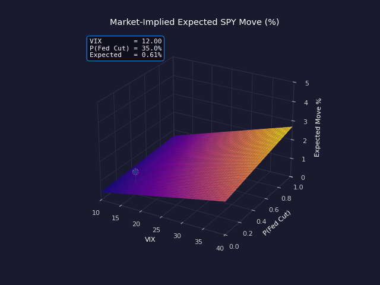

The VIX is the system's primary magnitude driver. Every expected-move calculation starts with `daily_σ = VIX / √252` (annualised vol → daily), then scales by the event's impact factor. The surface above is the model output `Expected SPY Move % = (VIX / √252) · (1 + 0.6 · P(Fed Cut)) · vol_factor`, evaluated over the full `(VIX, P(Fed Cut))` plane.

- **What animates:** `VIX` sweeps from 12 → 35 → 12 (low-vol regime to crisis-vol and back); `P(Fed Cut)` oscillates around 35%. Every cell in the surface is multiplied by `VIX / 18`, so the entire sheet lifts as VIX rises.
- **The green dot** marks the *current* market reading on the surface — i.e. the cell that corresponds to today's VIX and Fed-cut probability.
- **In the code:** `MarketDataFetcher.calculate_implied_volatility_from_vix()` (`src/data/market_data_fetcher.py`).
- **HUD live values:** current `VIX`, `P(Fed Cut)`, resulting `Expected Move %`.

#### 2. Yield Curve Shape → Rate expectations and recession risk


The Treasury curve encodes two independent macro signals: the **front-end** (3M T-bill, set by Fed policy) and the **long-end** (30Y, set by long-run growth + inflation expectations). Their *spread* signals recession risk — an inverted curve (10Y < 3M) has historically preceded every US recession. The system tracks 3M / 5Y / 10Y / 30Y in real time and classifies the slope as NORMAL / FLAT / INVERTED.

- **What you see:** the full curve as a surface across `Time × Tenor`. Z-axis is yield %.
- **What animates:** front-end and long-end oscillate on independent periods. The slope shape flips back and forth across the run, so you watch real regime transitions instead of a static snapshot.
- **In the code:** `MarketDataFetcher.calculate_yield_curve_expectations()`. Uses Yahoo tickers `^IRX`, `^FVX`, `^TNX`, `^TYX`.
- **HUD live values:** 3M and 30Y yield, slope in basis points, shape label.

#### 3. Fed Funds Futures (`ZQ=F`) → Probability of rate cuts/hikes

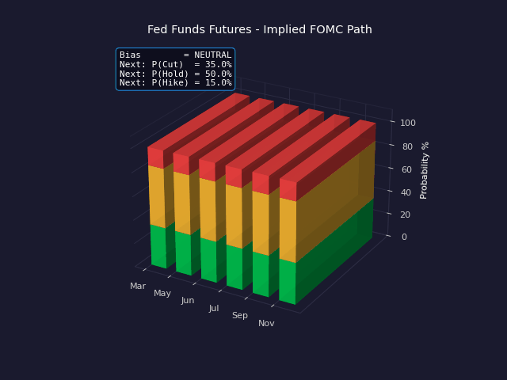

CME Fed Funds Futures price the implied rate path eight FOMC meetings out. Inverting `100 − price` gives the market's expected effective Fed rate per meeting; comparing successive meetings yields `P(Cut)`, `P(Hold)`, `P(Hike)`. These probabilities feed the directional-bias logic for any rates-related event.

- **What you see:** stacked probability bars per upcoming FOMC meeting (Mar / May / Jun / Jul / Sep / Nov). Green = `P(Cut)`, amber = `P(Hold)`, red = `P(Hike)`. Bars sum to 100%.
- **What animates:** the market's mood swings dovish ↔ hawkish (sinusoid). Conviction decays with horizon, so near-term meetings show sharper probability splits than distant ones.
- **In the code:** `MarketDataFetcher.calculate_fed_funds_expectations()`. Falls back to a yield-curve-derived synthetic path if `ZQ=F` is unavailable.
- **HUD live values:** current bias label (DOVISH / NEUTRAL / HAWKISH) and the next meeting's `P(Cut)`, `P(Hold)`, `P(Hike)`.

#### 4. TIPS Spreads (TIP/TLT ratio) → Inflation expectations

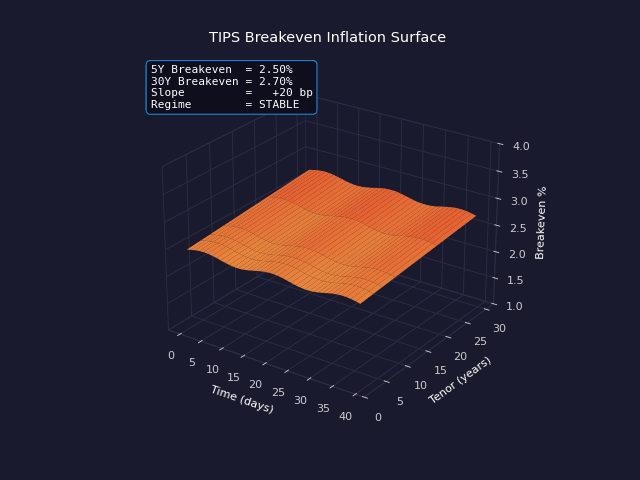

Subtracting the TIPS yield from the matched-tenor nominal yield gives the *breakeven inflation rate* — a market-implied forecast of average CPI over that tenor. The system uses a TIP/TLT-ratio approximation when direct TIPS yields aren't easy to scrape. Inflation surprises (CPI, PCE) get sign-flipped through this expectation: a CPI beat is bearish for risk assets only if breakeven inflation is *already rising*, otherwise the magnitude is dampened.

- **What you see:** breakeven inflation surface across tenor (2Y / 5Y / 7Y / 10Y / 20Y / 30Y) and time.
- **What animates:** 5Y breakeven sweeps 1.8% → 3.2% (one full inflation cycle). The 5Y end is more reactive than the 30Y, so the surface tilts as expectations shift.
- **In the code:** `MarketDataFetcher.calculate_inflation_expectations()`.
- **HUD live values:** 5Y and 30Y breakevens, slope in basis points, regime label (RISING / STABLE / FALLING).

#### 5. VIX Term Structure → Volatility-regime multipliers (×0.7 to ×2.0)

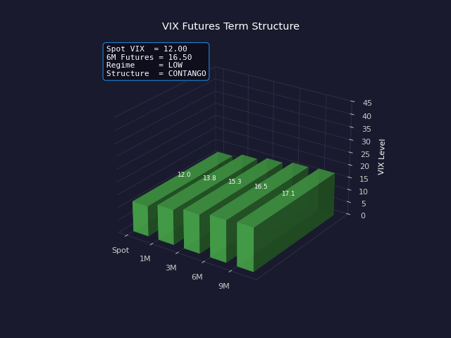

The VIX-futures curve normally sits in **contango** (longer-dated futures > spot, because of the volatility risk premium). When spot VIX spikes during stress events, the curve flips to **backwardation** (spot > 1M > 3M). The system reads this shape and applies a regime multiplier — low VIX = ×0.7, normal = ×1.0, high = ×1.5, extreme = ×2.0 — to every expected-move calculation.

- **What you see:** five tenors as 3D bars (Spot / 1M / 3M / 6M / 9M). Long-dated futures mean-revert toward 18.
- **What animates:** spot VIX ramps 12 → 38. Bars turn green in CONTANGO and red in BACKWARDATION; long futures stay anchored while spot diverges.
- **In the code:** `ImpactAnalyzer.VOLATILITY_MULTIPLIERS` (`src/analysis/impact_analyzer.py`), classified by `ImpactAnalyzer.identify_regime()`.
- **HUD live values:** spot VIX, 6M futures, regime bucket, structure label.

### Live Macro Inputs (FRED)

#### 6. Live Macro Releases → Fresh `previous` + consensus on every run

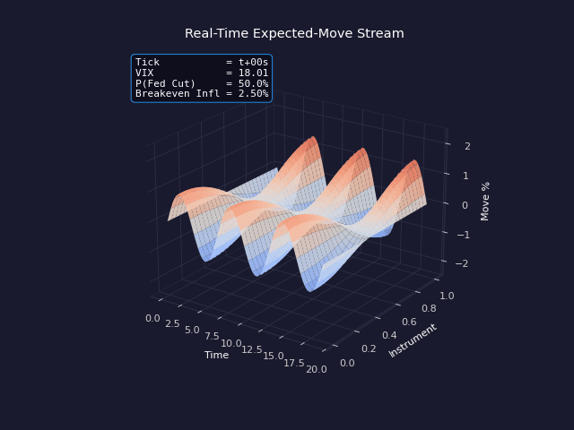

Instead of hard-coded values, the system pulls each tracked indicator from FRED at every run via `ConsensusLoader`: CPIAUCSL, CPILFESL, PAYEMS, UNRATE, PCEPILFE, GDP, ISM, RSAFS, ICSA, etc. The latest actual becomes `previous`; a trailing-3-period mean serves as the `consensus` proxy. Releases stream in continuously and re-shape every downstream calculation.

- **What you see:** rolling `time × instrument` surface where height is the *expected intraday move* per instrument.
- **What animates:** a pre-generated tick stream of `VIX`, `P(Fed Cut)` and `Breakeven Inflation`. Wave speed scales with the latest VIX tick — high VIX = faster, sharper wiggles.
- **In the code:** `src/data/consensus_loader.py:EVENT_TO_FRED` maps each event name to a FRED series + transformation.
- **HUD live values:** current tick number (`t+Ns`), live VIX, P(Fed Cut), Breakeven Inflation.

#### 7. Live Fed Funds Target Rate (DFEDTARU) → Baseline policy rate

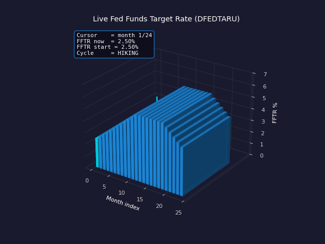

The `current_rate` baseline used to anchor cut/hike probabilities used to be a hard-coded `5.25` — that's gone. Now it's pulled fresh from FRED's `DFEDTARU` (Fed Funds Target Range, Upper) on every `PredictionEngine` instantiation and injected into `MarketDataFetcher` via `set_current_fed_rate()`. This single change is what allows the system to handle a full hike-then-cut cycle without manual edits.

- **What you see:** 24-month FFTR walk through a hike-and-cut cycle (2.5% → 5.5% → 4.0%). One bar per month.
- **What animates:** a cyan **TODAY** cursor walks across the timeline; the bar at the cursor turns cyan, all others stay blue.
- **In the code:** `ConsensusLoader.get_current_fed_funds_rate()` queries `DFEDTARU`; injected by `PredictionEngine.__init__()`.
- **HUD live values:** cursor position, current FFTR, starting FFTR, current cycle phase (HIKING / PEAK / CUTTING).

#### 8. Manual Consensus Override (`data/consensus_overrides.json`) → Pin user values

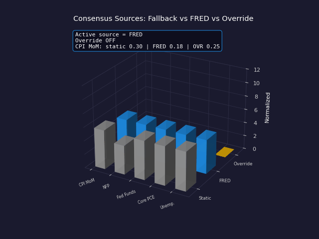

Three sources feed `EconomicCalendar.consensus_estimates`, in priority order: **(1)** static fallback (the snapshot in `CONSENSUS_ESTIMATES`), **(2)** FRED-derived proxy (latest release + trailing-3 mean), **(3)** user JSON overrides. Override always wins. This is meant for release mornings: paste in the morning's ForexFactory / Investing.com consensus for the upcoming print and the model uses that exact number.

- **What you see:** three side-by-side bars per indicator. Grey = static, blue = FRED, yellow = override.
- **What animates:** the override (yellow) fades in mid-clip; once present it dominates and the active source flips to OVERRIDE.
- **In the code:** `ConsensusLoader.load_all()` merges sources in priority order; checked at every `EconomicCalendar(auto_refresh=True)` call.
- **HUD live values:** active source label, fade-in progress, raw values for CPI MoM in all three columns.

### Model Mechanics (Reaction Calibration)

#### 9. Historical Sensitivity Matrix → 1σ surprise → expected move per instrument

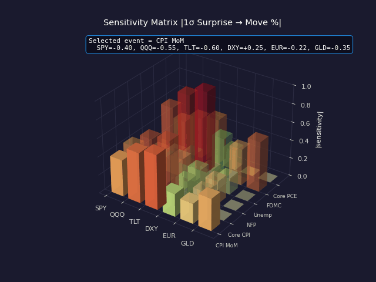

The sensitivity matrix is the empirical core of the directional model: for every (event, instrument) pair, it stores the historical move-per-1σ-surprise coefficient. Examples: `CPI MoM × SPY = −0.40%` (a 1σ CPI beat moves SPY down ~0.4%), `NFP × DXY = +0.30%`, `FOMC × TLT = −0.90%`. Multiply by the surprise z-score (next item) and you get the directional move.

- **What you see:** 6×6 grid of bars. Rows = events (CPI MoM, Core CPI, NFP, Unemp, FOMC, PCE), columns = instruments (SPY, QQQ, TLT, DXY, EUR, GLD). Bar height = `|sensitivity|`, color codes sign (red = down, green = up).
- **What animates:** one event row at a time gets full opacity; the others dim to 0.4. Cycles through all six rows.
- **In the code:** `SurpriseCalculator.SENSITIVITY_MATRIX` (`src/analysis/surprise_calculator.py`).
- **HUD live values:** active event name and its full row (`SPY=+0.25, QQQ=+0.30, TLT=−0.35, DXY=+0.30, EUR=−0.25`).

#### 10. Surprise Z-Score Engine → 7-bucket classifier

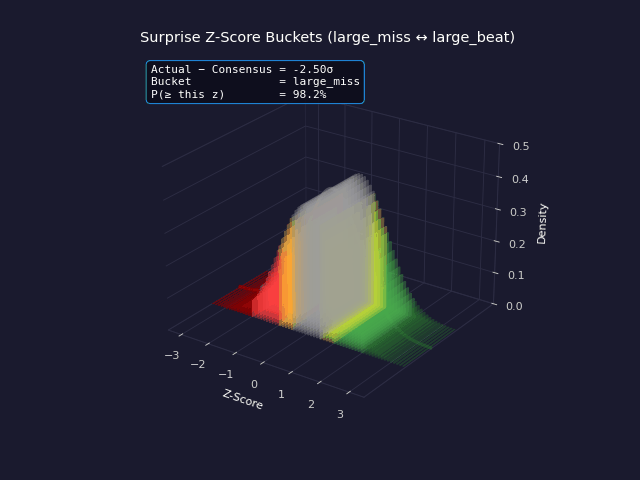

`(actual − consensus) / HISTORICAL_STD[indicator]` produces a z-score; the system buckets it into 7 categories and feeds the bucket label into the directional logic. Per-indicator `HISTORICAL_STDS` are calibrated empirically (CPI MoM = 0.15, NFP = 80k, Fed Funds = 0.125, etc.). A 0.6% CPI MoM with consensus 0.3% → z = +2.0 → `large_beat` bucket → max bearish bias for risk assets.

- **What you see:** standard normal bell curve in 3D, partitioned into 7 colored zones (dark red `large_miss`, red `miss`, amber `slight_miss`, grey `inline`, lime `slight_beat`, green `beat`, dark green `large_beat`). Bucket boundaries: ±0.5σ, ±1σ, ±2σ.
- **What animates:** a cyan marker (the actual release) walks across z = −2.5 → +2.5. The bucket it currently sits in lights up at full opacity; others dim.
- **In the code:** `SurpriseCalculator.calculate_surprise()` and `_classify_direction()`.
- **HUD live values:** current z-score, bucket label, tail probability `P(≥ this z)`.

#### 11. Event-Type Multipliers → Volatility scaling per category

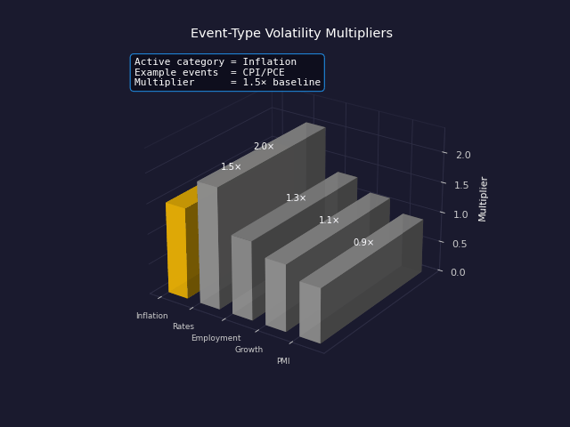

Different event categories cause systematically different magnitudes — FOMC days move SPY ~2× more than retail-sales days. The system multiplies the base expected move by a per-category volatility factor: `inflation 1.5×, rates 2.0×, employment 1.3×, growth 1.1×, PMI 0.9×`. These come from realized-vol regressions on event-day vs non-event-day returns.

- **What you see:** five 3D bars, one per category. Height = the multiplier value (clearly labelled `1.5×`, `2.0×`, etc.).
- **What animates:** one category at a time turns yellow ("active"); others stay grey.
- **In the code:** `PredictionEngine._get_event_volatility_multiplier()`.
- **HUD live values:** active category, example events (e.g. NFP/Unemp for Employment), multiplier value.

#### 12. Event-Impact Level Multipliers → LOW 0.5× / MED 0.8× / HIGH 1.2× / CRITICAL 1.8×

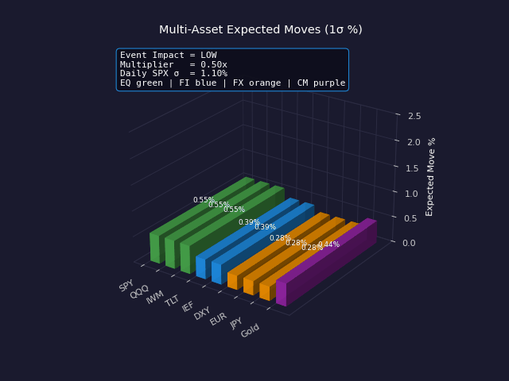

Within a category, individual events still vary in impact. The `EventImpact` enum is mapped to a multiplier: `LOW 0.5, MEDIUM 0.8, HIGH 1.2, CRITICAL 1.8`. Combined with the event-type multiplier above, a CPI release (`inflation` × `CRITICAL`) compounds to `1.5 × 1.8 = 2.7×` over the daily-vol baseline.

- **What you see:** one bar per tracked instrument (SPY, QQQ, IWM, TLT, IEF, DXY, EUR, JPY, Gold). Bar height = expected 1σ move %, color codes asset class (🟢 equity / 🔵 bonds / 🟠 FX / 🟣 commodity).
- **What animates:** the impact level cycles `LOW → MEDIUM → HIGH → CRITICAL`. Every bar re-scales by the new multiplier; relative shape (set by asset-class scaling) is preserved.
- **In the code:** `PredictionEngine._get_impact_multiplier()`.
- **HUD live values:** current impact level, multiplier value, baseline daily SPX σ.

#### 13. Cross-Asset Type Scaling → eq 1.0× / fi 0.7× / fx 0.5× / cm 0.8×

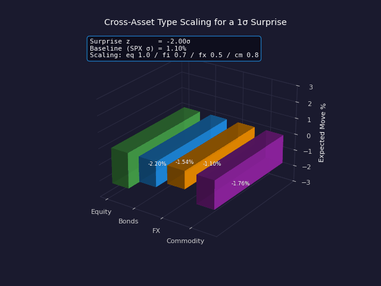

The same surprise produces different sized moves in % terms across asset classes — bonds typically move ~70% of equity moves, FX ~50%, commodities ~80%. These cross-asset scalars are applied last, after the directional + magnitude calculation, so the model produces internally consistent moves across SPY, TLT, DXY and gold for the same event.

- **What you see:** four bars, one per asset class (Equity, Bonds, FX, Commodity). Same horizontal axis as the rest; height is now signed (can go negative for risk-off scenarios).
- **What animates:** the *surprise z-score* sweeps from −2σ (deep red, bars below zero) through 0 to +2σ (deep green, above zero). All four bars move in lockstep but at different magnitudes — equity travels furthest, FX least.
- **In the code:** `PredictionEngine._calculate_instrument_expected_move()` line `type_multipliers = {...}`.
- **HUD live values:** current surprise z, baseline SPX σ, scaling factors.

#### 14. Market Regime Classifier → risk_on/off × expansion/recession_risk

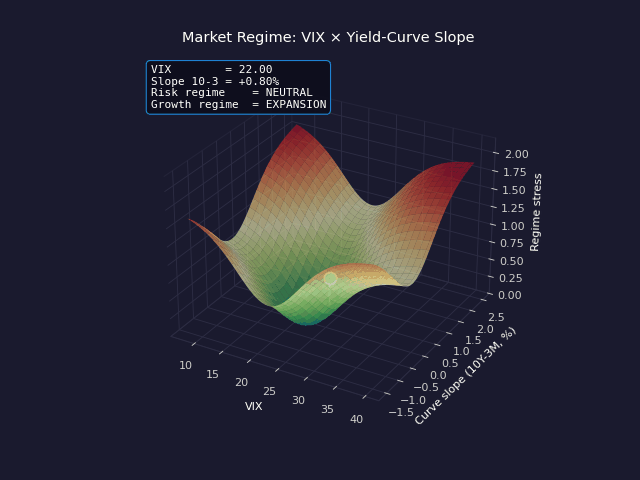

A combined classifier reduces the full state space to one of four regimes: **risk_on × expansion**, **risk_on × recession_risk**, **risk_off × expansion**, **risk_off × recession_risk**. Inputs are VIX regime (low/normal/high) and yield-curve slope (inverted vs normal). The regime modulates the *sign and strength* of the directional bias — e.g. a strong NFP print is bullish in risk_on regimes but bearish in risk_off regimes (because rate-hike fears outweigh the good news).

- **What you see:** stress surface over `VIX × yield-curve slope`. Z-axis is the regime stress score; corners are the four extreme regimes.
- **What animates:** a cyan marker traces a closed path through all four quadrants — one full economic cycle.
- **In the code:** `MarketDataFetcher._determine_market_regime()`.
- **HUD live values:** VIX, slope (10Y−3M), risk regime label, growth regime label.

### Output Engines

#### 15. Monte-Carlo Distribution Sampler → P(Up), P(Down), 5/95 percentiles

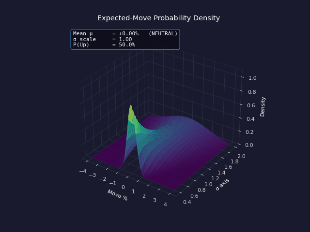

For every event/instrument pair, the system runs 1000 Monte-Carlo samples drawn from `N(μ_directional, σ_event_vol)`. The result is the full distribution: mean, median, 5th/25th/75th/95th percentiles, `P(Up)`, `P(Down)`, and `prob_large_move` (>1%). This is what powers the upside/downside risk numbers shown in the CLI banner.

- **What you see:** the 3D normal-density surface `Z = N(X; μ, σ)`. X = move %, Y = σ axis (vol), Z = density.
- **What animates:** the **mean μ** (directional bias from Fed/inflation expectations) shifts left/right; the **σ scale** (overall vol regime, driven by VIX) widens/narrows the surface.
- **In the code:** `ImpactAnalyzer.estimate_impact_probability()`.
- **HUD live values:** current `μ` and bias label (BULLISH / NEUTRAL / BEARISH), `σ scale`, resulting `P(Up)`.

#### 16. 5-Scenario Analysis → large_beat / beat / inline / miss / large_miss

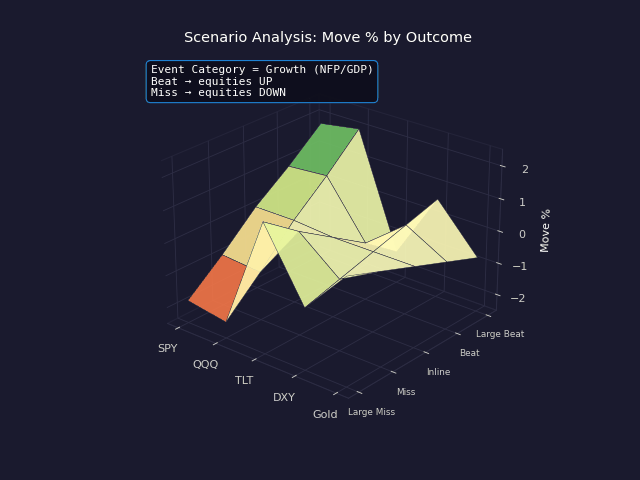

For every event, the system pre-computes the expected per-instrument move under each of five outcome scenarios, with attached probability weights `5% / 20% / 50% / 20% / 5%`. The trick: **the sign flips** between event categories. For *growth* events (NFP, GDP) a beat is bullish for SPY; for *inflation* events (CPI, PCE) a beat is bearish.

- **What you see:** 5×5 surface (5 scenarios × 5 instruments). Color codes direction (red = down, green = up).
- **What animates:** the event category cross-fades between **Growth (NFP/GDP)** and **Inflation (CPI/PCE)**. Watch the entire surface mirror across the inline-row.
- **In the code:** `PredictionEngine._generate_scenario_analysis()`.
- **HUD live values:** current event category, beat/miss bias for equities under that category.

#### 17. Risk Assessment Score (0–10) → LOW / MEDIUM / HIGH / EXTREME

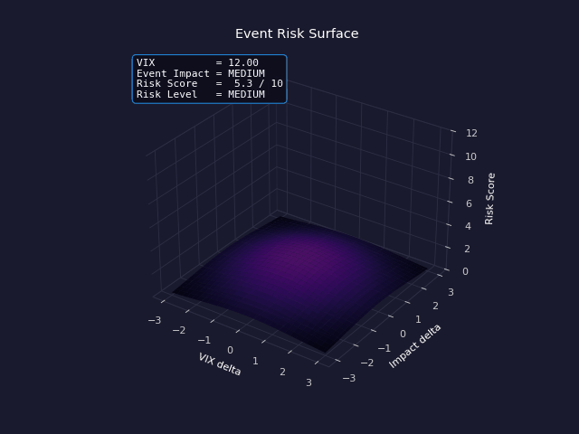

A combined score `(VIX/20 + impact_score/2) × 3`, capped at 10, then bucketed: <3 LOW, 3–6 MEDIUM, 6–8 HIGH, >8 EXTREME. Each bucket comes with a positioning recommendation ("normal positioning", "reduce position size", "consider closing positions before event"). This is the single number you should read first on a release morning.

- **What you see:** a peak whose height = the combined risk score.
- **What animates:** VIX ramps 12 → 35. As VIX rises the peak climbs (higher risk) **and sharpens** (concentrated tail risk in high-vol regimes). The implied event-impact label steps up in lockstep.
- **In the code:** `PredictionEngine._calculate_risk_assessment()`.
- **HUD live values:** current VIX, derived event-impact bucket, numeric `Risk Score / 10`, qualitative `Risk Level`.

#### 18. Implied-Expectation Reverse-Engineering → infer the consensus the market is pricing

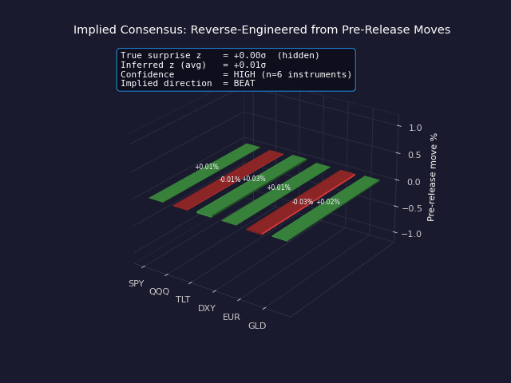

The most subtle output: given the *current pre-release moves* across multiple instruments, the system inverts the sensitivity matrix to back out the *surprise z-score the market has already priced in*. If pre-release moves are consistent with z = +0.8, the market is "leaning beat" before the print — and any actual that prints below z = +0.8 will *cause a sell-off even if the headline beats consensus*.

- **What you see:** signed bars per instrument showing the inferred pre-release moves (green = up, red = down).
- **What animates:** the (hidden) "true" surprise z-score sweeps ±1.5σ; pre-release moves are generated from it via the sensitivity matrix; the system then inverts that mapping to recover an estimate.
- **In the code:** `SurpriseCalculator.get_market_priced_expectation()`.
- **HUD live values:** true z (hidden), inferred z (averaged across instruments), confidence level, implied direction (BEAT / MISS).

#### 19. Combined Multi-Surprise Impact → simultaneous releases

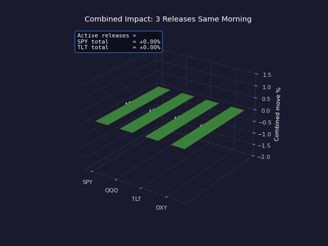

When several events release the same morning (e.g. CPI MoM + Core CPI + Retail Sales at 08:30 ET), per-event sensitivities are summed *with proper sign handling* per instrument. Some pairs reinforce (CPI + Core CPI both push SPY down), others partially offset (CPI down + Retail up).

- **What you see:** stacked 3D bars per instrument (SPY, QQQ, TLT, DXY). Each layer is one event's contribution: red = CPI MoM, amber = Core CPI, green = Retail Sales.
- **What animates:** events stack on one at a time over three stages, so you see how the combined total grows release by release.
- **In the code:** `SurpriseCalculator.calculate_combined_surprise_impact()`.
- **HUD live values:** active releases, total move for SPY and TLT.

#### 20. Cross-Instrument Correlation Matrix → rolling regime-aware correlations

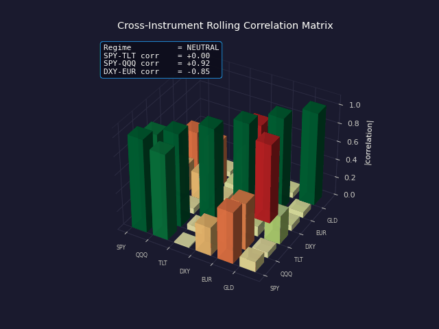

A rolling-window correlation matrix across the prediction universe. The interesting bit: correlations *aren't constant* — they migrate toward +1 in risk-off regimes (everything sells together) and decompose in risk-on regimes (clean diversification). The system tracks this and warns when "diversification is failing" because the cross-asset hedges no longer hedge.

- **What you see:** 6×6 grid (SPY, QQQ, TLT, DXY, EUR, GLD). Bar height = `|correlation|`, color codes sign (red = negative, green = positive).
- **What animates:** the regime shifts toward RISK_OFF then back. Watch SPY-TLT correlation flip from negative (normal hedge) to positive (forced selling) and back.
- **In the code:** `ImpactAnalyzer.get_correlation_matrix()`.
- **HUD live values:** regime label, SPY-TLT correlation, SPY-QQQ correlation, DXY-EUR correlation.

### User-Facing Surfaces

#### 21. Economic Calendar → upcoming events with consensus

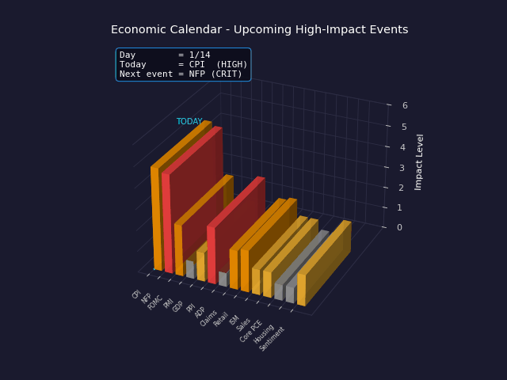

The calendar is the input timeline that drives the whole engine. It's not pulled from an external API (which would require a paid feed) — instead it generates events deterministically from publication rules: NFP on first Friday, CPI on second Wednesday, FOMC on third Wednesday of meeting months, Initial Claims every Thursday, Core PCE on last Friday ≥ 25th, etc. The dates are always relative to `datetime.now()`, so a run on May 6 sees CPI on May 13.

- **What you see:** 14 upcoming events on the X-axis, bar height = impact level (grey/yellow/orange/red = LOW/MED/HIGH/CRITICAL).
- **What animates:** a cyan **TODAY** cursor walks along the timeline. Bars within ±2 days of today are *boosted* in height (priority of imminent events) and the bar at today's index pulses.
- **In the code:** `EconomicCalendar._generate_events_for_date()`. Consensus and previous values are then refreshed from FRED via `_refresh_from_fred()`.
- **HUD live values:** current day index, today's event + impact, next event + impact.

#### 22. Interactive Dashboard → live Dash web app


The dashboard is the user-facing presentation layer. Launched via `python main.py dashboard`, it serves at `http://127.0.0.1:8050` and bundles all the engine's outputs: live VIX/Fed/curve indicators, the events table, prediction charts, scenario comparisons, risk gauges. The animation below is a stylised representation showing how the six top-level indicator towers stream new values out of phase.

- **What you see:** six dashboard indicators as 3D towers in a 3 × 2 grid: `VIX`, `P(Fed Cut)%`, `10Y-3M spread`, `Breakeven Inflation`, `Risk score`, `Daily σ`. Tower height = each indicator's normalized value (0–10 scale per indicator using its own swing range).
- **What animates:** all six indicators stream new values out of phase — the exact behaviour of the live Dash front-end.
- **In the code:** `src/visualization/dashboard.py`.
- **HUD live values:** raw numeric value of every indicator (VIX in points, P(Fed Cut) in %, 10Y-3M in %, Breakeven in %, Risk in /10, Daily σ in %).

> All 22 animations are generated by `assets/generate_3d_visualizations.py`. Re-run the script to regenerate the GIFs after dependency or styling changes (filenames are versioned via the `GIF_SUFFIX` constant at the top of the file to bypass browser/CDN caches).

## Data Freshness

Every CLI run pulls live data — there are no hard-coded snapshot values left
in the prediction path:

| Layer                       | Source                                  | Refreshed                |
|-----------------------------|-----------------------------------------|--------------------------|
| Upcoming events / dates     | Generated from `datetime.now()`         | every run                |
| `previous` (last release)   | FRED series (CPIAUCSL, PAYEMS, …)       | every run, 24h disk-cached |
| `consensus` proxy           | FRED trailing-3-period mean             | every run, 24h disk-cached |
| Fed Funds Target Rate       | FRED `DFEDTARU`                         | every run                |
| VIX / yields / FX / gold    | yfinance live                           | every run, in-process    |
| `consensus` manual override | `data/consensus_overrides.json`         | always wins              |

Bypass the 24-hour FRED disk cache (e.g. on a release morning):

```bash
python main.py predict --refresh           # forces a fresh FRED pull
python main.py quick --refresh
```

The CLI prints a banner at the top of every run so you can see exactly
when the data was refreshed:

```
================================================================================
MACRO EVENT IMPACT PREDICTIONS
================================================================================
Run timestamp:    2026-05-06 16:55:43 (local)
Predicting from:  2026-05-06 forward (next 14 days)
Consensus source: FRED  (refreshed at 2026-05-06T16:55:43)
Market data:      yfinance (live)
================================================================================
```

To pin specific consensus numbers (e.g. paste in the morning's ForexFactory /
Investing.com consensus before a CPI print), copy
`data/consensus_overrides.example.json` to `data/consensus_overrides.json`
and edit the values. They override both the FRED proxy and the static fallback.

If FRED is unreachable (no API key, network down, rate limit), the system
falls back to the static defaults in `EconomicCalendar.CONSENSUS_ESTIMATES`
and logs a warning.

## Installation

```bash
# Clone the repository
git clone https://github.com/yourusername/Macro-Impact-Predictions-.git
cd Macro-Impact-Predictions-

# Create virtual environment
python -m venv venv
source venv/bin/activate  # On Windows: venv\Scripts\activate

# Install dependencies
pip install -r requirements.txt

# Copy environment template
cp .env.example .env
# Edit .env and add your API keys (optional but recommended)
```

### API Keys (Optional)

For best results, get free API keys:
- **FRED API**: https://fred.stlouisfed.org/docs/api/api_key.html
- **Alpha Vantage**: https://www.alphavantage.co/support/#api-key

The system works without API keys using demo/sample data.

## Quick Start

### 1. View Predictions (CLI)

```bash
# Show predictions for next 7 days
python main.py predict

# Show predictions for next 14 days with HTML charts
python main.py predict -d 14 --html

# Quick prediction for next event
python main.py quick
```

### 2. Launch Interactive Dashboard

```bash
python main.py dashboard
```

Then open http://127.0.0.1:8050 in your browser.

### 3. Use as Library

```python
from src.models.prediction_engine import PredictionEngine
from src.data.economic_calendar import EventImpact

# Initialize engine
engine = PredictionEngine()

# Get market-implied expectations
market_exp = engine.get_market_implied_expectations()
print(f"VIX: {market_exp['vix_current']}")
print(f"Daily SPX Move: ±{market_exp['daily_expected_move_spx']:.2f}%")
print(f"Fed Expectation: {market_exp['fed_next_meeting']}")

# Get predictions for upcoming events
predictions = engine.get_upcoming_predictions(
    days_ahead=7,
    min_impact=EventImpact.HIGH
)

for pred in predictions:
    spy_move = pred.expected_moves.get('SPY')
    print(f"\n{pred.event.event_name}:")
    print(f"  Expected SPY Move: ±{spy_move.expected_move_pct:.2f}%")
    print(f"  P(Up): {spy_move.probability_up*100:.0f}%")
```

## Output Example

```
📊 CURRENT MARKET EXPECTATIONS:
   VIX: 18.5 (normal volatility)
   Daily SPX Expected Move: ±1.17%
   Fed Next Meeting: hold (Cut: 35%)
   Yield Curve: Normal
   Risk Regime: neutral

[1] CPI MoM
    Date: 2024-01-11 08:30 ET
    Impact: CRITICAL
    Consensus: 0.3%

    📈 PREDICTED MOVES:
       SPY: ↓ ±0.89% (1σ: 1.75%) | P(Up): 42%
       TLT: ±1.22% (Bonds)
       DXY: ±0.58% (USD)

    🎯 SCENARIO ANALYSIS:
       BEAT         → SPY: -1.75%
       INLINE       → SPY: +0.18%
       MISS         → SPY: +1.75%

    ⚠️  Risk Level: MEDIUM (Score: 5.2/10)

    📌 KEY DRIVERS:
       • VIX at 18.5 (normal volatility)
       • Market pricing 35% cut / 10% hike
```

## Project Structure

```
Macro-Impact-Predictions-/
├── main.py                 # Main CLI entry point
├── requirements.txt        # Python dependencies
├── config/
│   └── settings.yaml      # Configuration file
├── src/
│   ├── data/
│   │   ├── macro_data_fetcher.py    # FRED/macro data
│   │   ├── market_data_fetcher.py   # Market prices & IV
│   │   ├── economic_calendar.py     # Event calendar
│   │   └── consensus_loader.py      # Live FRED consensus refresh
│   ├── analysis/
│   │   ├── impact_analyzer.py       # Historical impact analysis
│   │   └── surprise_calculator.py   # Surprise metrics
│   ├── models/
│   │   └── prediction_engine.py     # Core prediction engine
│   ├── visualization/
│   │   ├── market_charts.py         # Plotly charts
│   │   └── dashboard.py             # Dash web app
│   └── utils/
│       ├── config_loader.py         # Configuration
│       └── logger.py                # Logging
├── examples/
│   ├── basic_usage.py               # Basic usage example
│   └── scenario_analysis.py         # Scenario analysis example
├── data/
│   └── consensus_overrides.example.json  # Sample override file
├── assets/
│   ├── generate_3d_visualizations.py     # GIF generator script
│   └── visualizations/                   # 22 animated 3D GIFs
└── tests/                                # Unit tests
```

## Tracked Events

### High-Impact Events
- **Inflation**: CPI, Core CPI, PCE, Core PCE
- **Employment**: Non-Farm Payrolls, Unemployment Rate, Initial Claims
- **Rates**: FOMC Decisions, Fed Chair Speeches
- **Growth**: GDP, Retail Sales
- **PMI**: ISM Manufacturing, ISM Services

### Predicted Instruments
- **Equities**: SPY, QQQ, IWM, DIA
- **Bonds**: TLT, IEF (Treasury ETFs)
- **FX**: DXY, EUR/USD, USD/JPY, GBP/USD
- **Commodities**: Gold (GC=F)
- **Volatility**: VIX

## Disclaimer

This system is for educational and research purposes only. The predictions are based on market-implied data and historical patterns, and should not be considered financial advice. Past performance does not guarantee future results. Always do your own research before making investment decisions.

## License

MIT License - See LICENSE file for details.

## Contributing

Contributions are welcome! Please feel free to submit a Pull Request.

## Support

For issues or questions, please open a GitHub issue.
